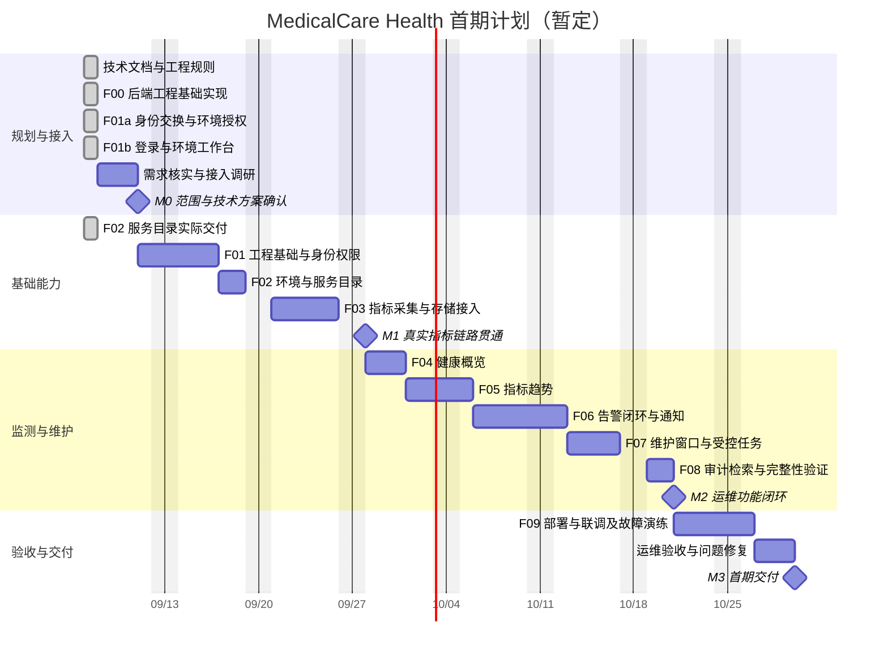

# 开发计划与甘特图

创建日期：2026-09-07。状态：已进入后端工程基础实现；实际进度见工作包与实施记录。

已确认健康指标为 MedicalCareWeb 系统运行指标；后续调研聚焦具体指标清单、采集来源与阈值。本次范围确认不改变甘特图工作包及工期估算。

排期假设：1 名全栈开发人员，运维人员提供接入资料与验收支持；采用每周一至周五工作日，暂未扣除法定节假日及请假。2026-09-08 为拟定启动日期，所有日期均为估算，不是上线承诺。M0 完成后依据人员、假期、接口条件和范围重排。

## 甘特图

以下 Mermaid 甘特图可在支持 Mermaid 的 Markdown 阅读器或 GitHub 中查看。

## 工作包与依赖

| 工作包 | 预计工作日 | 前置依赖 | 交付及验收 | 当前状态 |
| --- | --- | --- | --- | --- |
| 文档初始化 | 1 | 无 | 技术文档、甘特图、Git 规则 | 文档已编写，Git 上传结果见提交交付记录 |
| F00 后端工程基础 | 1（提前实施，计入 F01 原估算） | 本机技术栈检查 | 启动、构建、配置与健康探测验证 | 已实现，上传结果见交付记录 |
| M0 调研 | 3 | MedicalCareWeb 资料 | 指标范围、栈、身份协议、数据源、维护接口及容量目标明确 | 进行中：已核实本机技术栈及身份、健康接口 |
| F01 基础与权限 | 4 | M0 | 可启动工程、登录与环境权限验证通过 | 进行中：F00、F01a、F01b 已实现；真实员工联调待完成 |
| F01a 身份交换与环境授权 | 1（提前实施，计入 F01 原估算） | F00、已知身份协议 | 会话撤销、越权拒绝、异常及持久化验证 | 已实现，上传结果见交付记录 |
| F01b 登录与环境工作台 | 1（提前实施，计入 F01 原估算） | F01a | 密码登录、退出、环境选择及异常状态浏览器验证 | 已实现，上传结果见交付记录 |
| F02 服务目录 | 2 | F01a/F01b 权限接口 | 服务配置、校验、授权与停用可用 | 已实现并验证（2026-09-07），上传结果见交付记录 |
| F03 指标接入 | 5 | F02、监控访问权限 | 真数据贯通，缺失、重复及超时处理通过 | 待开始 |
| F04 健康概览 | 3 | F03 | 状态原因和数据新鲜度正确展示 | 待开始 |
| F05 趋势 | 3 | F03、F04 | 时间范围、粒度、单位及聚合验证通过 | 待开始 |
| F06 告警 | 5 | F03、通知接入条件 | 触发、确认、恢复、去重及重试验证通过 | 待开始 |
| F07 维护 | 4 | F01、F02、F06 | 窗口静默和受控任务权限、幂等及异常结果验证通过 | 待开始 |
| F08 审计查询 | 2 | F01～F07 已落地审计写入 | 检索、脱敏和不可修改边界验证通过 | 待开始 |
| F09 部署联调 | 4 | F01～F08 | 部署、备份恢复、故障演练及回退验证记录 | 待开始 |
| 运维验收 | 3 | F09、运维验收人员 | 核心流程签收、阻断问题关闭、手册交付 | 待开始 |

调研至验收合计 38 个工作日，另计文档初始化 1 日。排期按单人串行执行；F08 仅集中实现审计检索，审计写入必须随 F01～F07 各功能同步完成。

## 里程碑门槛

- M0：范围与接入能力明确，最终技术选择和性能验收规模写入技术文档。
- M1：至少一个实际环境与服务完成采集、存储和查询；模拟数据不能代替接入验收。
- M2：异常发现、告警处置、维护记录与审计可串联追踪；未获授权的生产动作不得纳入验收演示。
- M3：测试环境部署和运行演练通过，运维验收完成。生产上线依照实际组织流程另行安排。

## 风险与调整

| 风险 | 影响 | 应对 |
| --- | --- | --- |
| 运行指标口径或阈值不明确 | 健康判定和告警验收受阻 | M0 明确指标清单、统计窗口及阈值依据 |
| 缺少指标源或身份接口 | F01 / F03 延期 | 先完成接口契约和模拟联调，真实接入门槛保留 |
| 维护接口缺失 | F07 自动操作受限 | 交付维护记录及探测重试，其余动作单独评估 |
| 样本规模高于预期 | 查询和存储成本上升 | M0 容量评估，限制标签基数并调整保留策略 |
| 假期与验收人不可用 | 日期顺延 | 确认真实工作日历及验收时间后重排 |

## 每功能交付记录

完成一个功能即执行相关验证、更新文档、commit、push，不等阶段结束再统一上传。可在后续实现时逐行登记：

| 日期 | 功能 | 验证结果 | 提交哈希 | 推送结果 | 剩余问题 |
| --- | --- | --- | --- | --- | --- |

提交哈希可在下一次文档更新中补记；当次交付回复必须说明真实提交与推送结果，避免为记录本次提交哈希产生循环提交。

## 当前实施说明

F00、F01a、F01b 的 `done` 表示代码及对应验证完成，Git 远程上传状态单独记录。F00 提交 `7d9fd87`、F01a 提交 `ad914d3` 推送时 GitHub 连接失败。M0、M1、M2、M3 均未达到完整验收；当前未接入真实监控数据。

下一步：完成真实员工授权联调，并推进 F03 健康探测。F02 使用已验证的权限 API 先行实现，未替代 F01 真实接入验收；实际交付行不叠加原计划工期。
