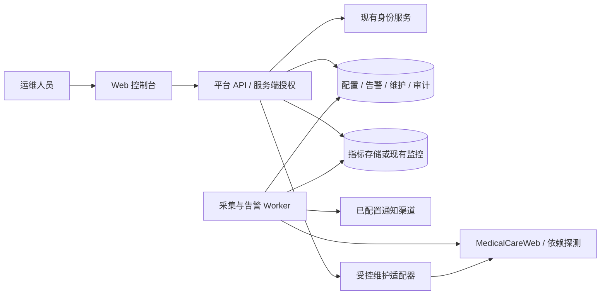

# MedicalCare Health 项目技术文档

版本：0.2；创建日期：2026-09-07；状态：运行指标范围已确认，技术方案待接入调研确认。

## 1. 项目目标与范围

为 MedicalCareWeb 运维人员提供统一的运行状态查看、指标趋势分析、告警处置和受控维护入口，缩短发现故障、定位问题与恢复服务的时间。

已确认：“健康指标”指 MedicalCareWeb 系统运行指标，包括服务可用性、接口延迟与错误率、CPU / 内存 / 磁盘资源使用情况及数据库、缓存、外部接口等依赖状态。平台围绕这些运行指标提供监测、告警及维护能力。患者体征、诊断结果及医疗设备业务数据不在本项目范围内。

首期交付：身份与权限、环境与服务管理、指标采集、健康概览、趋势查询、告警规则及事件、维护记录与受控操作、操作审计、部署与运行手册。

暂不包含：自动故障修复、任意命令终端、自动扩缩容、复杂预测、大规模多租户和患者数据分析。

## 2. 使用角色

| 角色 | 允许能力 |
| --- | --- |
| 只读观察者 | 查看授权环境的概览、指标、告警和维护记录 |
| 运维人员 | 查看、确认及处理告警，创建维护窗口，执行已授权维护动作 |
| 管理员 | 管理环境、服务、规则、用户授权及维护动作白名单 |

权限至少按“环境 + 资源 + 动作”校验；生产与测试环境区分展示和授权。全部写操作在服务端鉴权。

## 3. 功能设计与验收

| 编号 | 功能 | 主要内容 | 验收条件 |
| --- | --- | --- | --- |
| F01 | 身份与权限 | 复用已有登录体系，角色与环境授权 | 未登录不可查询，越权请求被拒绝，退出后会话失效 |
| F02 | 环境与服务目录 | 环境、服务、探测地址、负责人、采集配置 | 配置可校验和停用；凭据不明文返回；服务归属明确 |
| F03 | 指标接入 | 可用性、延迟、错误率、资源与依赖采集 | 真实样本可查询；超时、缺失、重复及乱序样本处理可验证 |
| F04 | 健康概览 | 环境筛选、状态卡片、异常服务、最近更新时间 | 能区分正常、警告、严重、未知、维护中；数据过期明显展示 |
| F05 | 指标趋势 | 时间范围、粒度、服务维度、阈值参考 | 指标单位和聚合方式一致；无数据不补零；查询有范围限制 |
| F06 | 告警闭环 | 阈值规则、持续窗口、去重、确认、恢复、通知 | 持续异常触发一次事件；恢复可追踪；通知失败可重试并可见 |
| F07 | 维护管理 | 维护窗口、任务记录、受控动作、执行结果 | 未授权不能执行；重复请求不重复操作；超时与失败留审计 |
| F08 | 审计查询 | 登录、配置、授权、告警处置、维护动作审计 | 可按操作者、对象、时间检索；普通用户不能修改审计 |
| F09 | 部署与交付 | 环境配置、部署、备份恢复、运行手册 | 在约定测试环境完成部署、故障演练与恢复验证 |

F07 初始仅支持记录型维护及探测重试。服务重启、缓存刷新等实际变更动作，须在确认 MedicalCareWeb 控制接口、授权范围及恢复步骤后逐项接入。

## 4. 建议技术架构

已只读核实本机 `F:\MedicalCareWeb` 的代码和依赖：主站使用 Next.js / React，chat-service 使用 Fastify / TypeScript，并已有员工身份与健康探测接口。后端工程已开始实现，其余部署方案继续调研。

- 前端：采用 TypeScript + Next.js / React，与 MedicalCareWeb 保持一致；已实现员工登录与授权环境工作台，默认 4320 端口，通过同源代理访问后端。
- 后端：采用 Fastify 5 + TypeScript，版本与现有 chat-service 对齐，独立运行于默认 4310 端口。
- 已实现身份基础：通过现有 `/auth/me` 交换独立平台会话；本地授权文件按员工 ID 明确分配角色和环境，每次请求重读。当前会话与审计采用 SQLite 单实例存储，上游令牌加密保存，不作为时序存储选型。配置、接口和上游撤销限制见 `docs/local-development.md`。
- 已实现服务目录：管理员登记、编辑、启停服务，版本校验与幂等创建，配置和审计同事务。探测目标由部署白名单绑定环境和固定 IP，接入说明见 `docs/service-monitoring.md`。
- 配置及业务数据：优先复用现有关系数据库；无既有约束时评估 PostgreSQL。
- 时序指标：已有 Prometheus 时复用其查询接口；没有现成监控时先实现受限规模的探测采集，并按容量评估时序存储。
- 后台任务：独立 Worker 负责采集、规则评估与通知；多实例部署需要任务租约或等价互斥措施。
- 部署：优先容器化并适配已有交付流程，是否使用 Kubernetes 由实际环境决定。

采集、查询和维护动作分开处理；平台自身故障不得阻断 MedicalCareWeb 主业务。探测必须设置超时、并发上限及重试退避，不对生产发起高负载测试。

## 5. 指标口径与健康判定

| 指标 | 口径 | 初始采集建议 |
| --- | --- | --- |
| 可用性 | 窗口内成功探测次数 / 有效探测次数；缺失探测单独统计 | 30 秒一次，5 分钟窗口 |
| API 延迟 | 同一时间窗内请求耗时分布的 P50 / P95 / P99，单位毫秒 | 从现有遥测或直方图聚合，不平均各实例分位数 |
| 错误率 | 窗口内服务端失败请求 / 总请求；业务失败需单独定义 | 1 分钟聚合，5 分钟评估；无请求时显示无流量 |
| CPU / 内存 / 磁盘 | 主机或容器利用率、使用量与容量，标明分母 | 30～60 秒一次 |
| 依赖状态 | 数据库、缓存及外部接口连接结果和耗时 | 30～60 秒一次，按依赖重要性区分 |
| 数据新鲜度 | 当前时间与最近有效样本时间差 | 超过配置容忍窗口显示未知 |

以上频率仅为调研起点；告警阈值应基于现有 SLO 和运行基线配置，不将示例值作为生产规则。

健康状态按关键指标和依赖规则计算，保留判定原因，不在首期用未经验证的综合分数掩盖单项故障。维护中是独立标记，仍保留底层健康状态。缺失数据不参与正常判定；必要指标缺失时显示未知，同时保留已知故障。

时间在服务端以 UTC 存储、传输，前端按明确时区展示，默认 Asia/Shanghai。趋势查询统一窗口边界及聚合粒度；重复采样通过样本身份去重，迟到数据可入库但不重复发送历史通知。

## 6. 告警与维护流程

告警规则包含资源范围、指标、聚合窗口、比较条件、持续时长、严重级别、恢复条件和通知策略。事件以“规则 + 服务 + 标签集合”去重，触发与恢复使用独立条件以降低抖动。

事件生命周期：触发 → 已确认（可选）→ 已恢复 → 已关闭。确认只代表有人跟进，不代表故障恢复；未恢复事件不允许按正常恢复关闭，误报关闭须记录原因。规则停用和资源删除需要保留历史并记录终止原因。

维护窗口明确环境、服务、开始与结束时间、负责人、原因及告警静默范围；静默仅停止匹配通知，保留指标与事件。通知通过可替换适配器接入，重试必须有上限、退避和去重；首期渠道在调研中确认。

维护任务状态：待执行 → 执行中 → 成功 / 失败 / 超时 / 结果未知。执行前验证权限、操作白名单和目标环境；高影响动作要求二次确认，记录操作参数摘要及恢复指引。幂等键避免重复提交；超时不代表远程操作未发生，禁止盲目重试，通过查询远端状态确定结果。

## 7. 数据模型

| 实体 | 核心字段 |
| --- | --- |
| Environment | id、name、type、enabled |
| Service | id、environmentId、name、owner、endpoint、enabled |
| ProbeConfig | id、serviceId、type、interval、timeout、credentialRef |
| MetricDefinition | key、unit、source、aggregation、labelSchema |
| MetricSample / 时序存储映射 | serviceId、metricKey、timestamp、value、labels、quality |
| AlertRule | id、scope、condition、duration、recovery、severity、enabled |
| AlertEvent | id、ruleId、fingerprint、state、firstSeen、lastSeen、recoveredAt、acknowledgedBy |
| MaintenanceWindow | id、scope、startAt、endAt、reason、owner |
| MaintenanceTask | id、actionType、target、idempotencyKey、state、operator、resultSummary |
| AuditEvent | id、actor、action、target、timestamp、requestId、outcome、redactedDiff |
| NotificationDelivery | id、eventId、channel、attempt、state、nextRetryAt |

配置保留修改时间和并发版本号。服务与告警历史采用停用或逻辑关联保留策略；审计尽量与业务写入同事务落地，外部维护动作先持久化任务与审计意图再执行。审计写入失败时阻止高影响动作。

数据保留初始建议：原始指标 30 天、聚合指标 180 天、事件与审计 180 天；这些是容量估算假设，最终按组织要求、成本及既有策略确认。清理任务需可观测、可配置；备份恢复验证覆盖配置、告警及维护记录。

## 8. API 约定与初始清单

前缀建议 `/api/v1`。列表支持分页、筛选和排序；限制最大时间范围、返回点数及页大小。统一错误结构包含 `code`、`message`、`requestId`。接口返回不包含凭据和内部堆栈。

| 方法与路径 | 用途 |
| --- | --- |
| GET /me | 当前身份及有效权限 |
| GET /environments | 可访问的环境 |
| GET /services；POST /services；PATCH /services/{id} | 服务查询与配置 |
| GET /health/overview | 环境健康汇总及数据时间 |
| GET /metrics/query | 指标、服务、起止时间、粒度查询 |
| GET /alert-rules；POST /alert-rules；PATCH /alert-rules/{id} | 规则查询与管理 |
| GET /alerts；POST /alerts/{id}/acknowledge | 事件查询与确认 |
| POST /alerts/{id}/close | 关闭及原因记录 |
| GET /maintenance-windows；POST /maintenance-windows | 维护窗口查询与创建 |
| GET /maintenance-tasks；POST /maintenance-tasks | 任务查询与提交 |
| GET /maintenance-tasks/{id} | 执行结果 |
| GET /audit-events | 审计检索 |

写接口校验输入与资源授权；配置更新使用版本检查避免覆盖；维护任务提交要求幂等键并返回任务标识。接口由实现生成 OpenAPI 文档，此表不代表接口已存在。

## 9. 安全与运行要求

- 复用 SSO/OIDC 等既有身份能力，具体协议以 MedicalCareWeb 为准；会话过期和吊销须有效。
- 全链路使用受信 TLS，服务间凭据按最小权限分配；日志中脱敏令牌、连接串及可能的医疗数据。
- 对探测地址和维护目标实施目标白名单及网络边界约束，防止利用配置入口访问未授权内部地址。
- 查询账号与维护账号权限分离；审计不可通过常规业务 API 修改。
- 平台提供自身存活与就绪检查，监控采集延迟、任务积压、查询失败和通知失败；平台失联由独立外部探测发现。
- 数据源失联时展示最后已知状态及过期标记，返回可区分的降级信息。

## 10. 测试、性能与交付

验证重点：健康状态边界、时间窗口聚合、权限隔离、缺失与迟到数据、告警去重与恢复、静默到期、维护幂等及执行结果不确定、审计完整性。

分层验证：领域规则单元测试；真实数据库与适配器集成测试；登录、概览、告警处置及维护任务的端到端测试。使用模拟指标注入异常与恢复，不能以未执行的测试作为完成依据。

初始性能验收假设：20 个服务、每服务 50 条活跃时序、30 秒采样、10 个并发查看用户；24 小时趋势和概览 API 的 P95 响应时间目标小于 2 秒。实际目标及测试机器配置在 M0 确认，结果附样本规模和环境。该假设约产生每日 288 万个样本，30 天约 8640 万个样本，需要在选型前评估索引、压缩及存储容量。

交付包括：源代码、部署配置示例、数据库迁移、OpenAPI、验收记录、运行手册、告警处置手册、备份恢复与版本回退步骤。每个功能完成后立即 commit 并 push，遵循根目录 `AGENTS.md`。

### F03a 已实施范围（2026-09-07）

首个采集适配器为白名单固定 IP 的 HTTP GET 健康探测，提供 3 秒超时、并发上限 4、自动/手动请求去重及审计。SQLite 保存最近 24 小时样本，查询当前配置版本的 5 分钟探测成功率；过期、无样本和配置变化均显示未知。具体调度、权限及指标口径见 `docs/service-monitoring.md`。此阶段只验证本机 HTTP 链路，不代表 M1 真实环境接入完成；完整时序存储、资源指标及上述容量/性能目标仍待后续实现与验证。

### F04a HTTP 健康概览（2026-09-07）

基于 F03a 提前实现授权环境的 HTTP 概览，统计正常、异常、未知、停用及过期服务数，列出异常/未知原因和负责人并链接到服务明细。已知异常优先保留；空目录、有未知或停用服务时不能将整个已登记集合判定正常。仅全部已登记服务的当前有效探测通过时显示探测正常，不推断未登记服务状态。

`GET /api/v1/health/overview?environmentId=...` 返回同一查询时间的 `items`、`overview`、`asOf` 及当前环境目标名称。服务目录接口也包含相同汇总，页面复用一次请求，避免概览与明细刷新时点不同。纯状态规则由 `src/health-summary.ts` 在 API 和浏览器共用；前端构建根目录扩展到仓库以读取该纯模块，不导入服务端存储或凭据模块。

F04 总体验收中的警告/严重级别依赖 F06 规则，维护中标记依赖 F07；本次不将停用映射为维护，也不编造严重等级。完整 F04 与真实环境验收仍待后续完成。

## 11. 接入前待确认事项

F06b（2026-09-08）增加授权环境告警中心及概览链接，支持活动/处置状态筛选、20 条分页、全环境活动和严重数量汇总。采用一次只读事务查询总数与列表，查询状态存入 URL，处理后刷新原筛选结果。详细口径见 `docs/http-alerts.md`；未将历史告警等级混入 HTTP 当前健康判定。

F06a 已实现单服务 HTTP 连续失败规则和平台内事件处理，支持 warning/critical 等级、自动恢复、人工确认和恢复后关闭。无数据不恢复，配置变更终止并保留原因。事件保存规则快照，评估与采样完成及审计同事务。具体规则、权限、边界见 `docs/http-alerts.md`。通知、持续时间规则、维护静默仍待后续实施；健康概览的探测状态与告警事件等级分别展示。

已先行完成 F05a HTTP 探测趋势：服务维度的最近 1/6/24 小时、固定 1/5/15 分钟聚合、成功率及平均响应头耗时、空值断点和精确分段表。接口为 `/api/v1/services/:id/trend`，口径与边界见 `docs/service-monitoring.md`。它不包含业务 P95、资源指标、跨配置历史或长期时序查询，完整 F05 仍依赖后续指标接入。

1. MedicalCareWeb 代码或接口位置、技术栈、环境列表与部署拓扑。
2. 运行指标的具体清单、采集来源、统计口径及告警阈值。
3. 已有认证、监控、日志、通知和数据库能力，以及可授权接入方式。
4. 关键服务、现有 SLO、告警联系人、通知渠道和维护动作清单。
5. 预计服务数、用户数、数据保留要求、上线窗口和实际投入人员。

上述事项影响实施；当前文档和甘特图可以先行审阅，不能据此宣称已完成接入或具备生产可用性。

F07a（2026-09-08）交付服务维护窗口记录、取消和查询，服务条目显示维护标记。采用独立表与原子审计、服务端角色/环境校验、创建 UUID 幂等、取消重试保护及明确时间边界。详见 docs/maintenance-windows.md。仅为记录，不停止采集或静默告警，不代表真实维护接口已接入。

F08a（2026-09-08）新增 GET /api/v1/audit，管理员按授权环境、操作类型和最长 31 天范围检索。只读事务返回总数和每页 20 条记录，既有审计经明确资源关联解析环境，仅返回必要追责字段。详见 docs/audit-query.md。登录审计无环境归属暂不返回；当前服务名称非历史快照，数据库防篡改、归档和查询界面尚未交付。

F08b 已接入管理员操作审计页面，支持类型、时间范围、分页及 URL 恢复，复用当前界面组件。权限仍由 F08a 服务端独立执行。审计保留和归档验收待完成。

F09a 提供本地一致性备份及新目录恢复工具，含完整性检查、SHA-256 清单和恢复会话清除。详见 docs/backup-recovery.md。未执行真实环境部署，备份保留、异地保存与 RPO/RTO 待验收。

备份范围纠正（2026-09-08）：MedicalCareWeb 仓库实际声明 PostgreSQL 17 + Prisma 6.12.0、Redis 7.4（AOF），依据 chat-service/prisma/schema.prisma、chat-service/package.json 和 deploy/compose.yaml。本平台 SQLite 是独立本地状态实现，F09a 仅验证该状态库备份。MedicalCareWeb PostgreSQL/Redis 备份及恢复尚未接入，须单独完成方案与验收；不能将 F09a 作为业务系统数据保护完成依据。

F09b 按 MedicalCareWeb 实际 PostgreSQL 部署实现 backup:medicalcare 本地命令，固定容器/数据库、二进制导出、目录检查、哈希清单及失败保护。清单明确 restoreVerified=false；不是平台 Web 维护动作。Redis 源码当前只用于 300 秒 presence，现场用途待核实。详见 docs/medicalcare-business-backup.md，真实恢复与 Redis 备份未验收。
